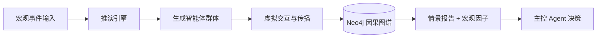

# 📈 AgenticHarness – AI 驱动的量化交易系统

> 基于 **Harness Engineering** 方法论构建的下一代量化交易平台。  
> 目标：通过多智能体协作 + 分层存储 + 高性能 Java 后端 + 情景推演引擎，实现从行情接入到策略执行、再到宏观沙盘推演的完整闭环。

---

## 🎯 项目亮点（面试速览）

- **全栈架构**：Java 21 + Spring Cloud Alibaba + Netty + Disruptor + Kafka + RocketMQ + ClickHouse + Redis 8.0
- **AI 原生**：AgentScope 多智能体编排、MCP 协议工具化、RAG 记忆检索、Human-in-the-loop
- **Harness Engineering**：`AGENTS.md` 规格书 + 自动化质检流水线 + 结构化反馈闭环
- **可观测性**：Prometheus + Grafana + SkyWalking 10（全链路追踪 + eBPF）
- **高性能**：Netty 微秒级行情处理、Disruptor 无锁队列、Java 21 虚拟线程
- **分层存储**：热（Redis）→ 温（PG+Mongo）→ 时序（InfluxDB+ClickHouse）→ 冷（MinIO）→ 向量（Redis Vector Sets）
- **二期规划**：基于 MiroFish 思想的群体智能推演引擎 + GraphRAG 因果推理

---

## 🏗 系统架构图（一期 + 二期规划）

```mermaid
graph TB
    subgraph Client [“前端”]
        A[Vue 3 + ECharts]
    end
    subgraph Gateway [“网关层”]
        B[Nginx + Spring Cloud Gateway]
    end
    subgraph Harness [“Harness Engineering 层”]
        C[AGENTS.md / MCP Servers / 自动化质检 / 反馈闭环]
    end
    subgraph Services [“业务服务层 (Java 21)”]
        D[行情服务] --> E[策略服务] --> F[订单服务]
        G[账户服务] --> H[风控服务] --> I[回测服务]
    end
    subgraph AI [“AI Agent 层”]
        J[主控Agent] --> K[技术分析师]
        J --> L[情绪分析师]
        J --> M[基本面分析师]
        J --> N[风控Agent]
    end
    subgraph Simulation [“二期：情景推演引擎”]
        S1[事件输入] --> S2[推演引擎<br>MiroFish风格]
        S2 --> S3[推演图谱库<br>Neo4j]
        S3 --> S4[情景报告生成]
    end
    subgraph Data [“数据存储层”]
        O[(Redis 8.0)] --> P[(PostgreSQL)]
        O --> Q[(ClickHouse)]
        O --> R[(MinIO)]
        O --> S[(MongoDB)]
    end
    subgraph Message [“消息层”]
        T[Kafka] --> U[RocketMQ]
    end
    subgraph Ops [“运维层”]
        V[K8s] --> W[Prometheus+Grafana]
        V --> X[SkyWalking 10]
    end
    Client --> Gateway --> Services
    Services --> Message --> Data
    AI --> Services
    Harness --> AI
    Harness --> Services
    Ops --> Services
    Simulation -->|宏观因子| AI
```

---

## 📂 项目目录结构（推荐）

```
agentic-harness/
├── .cursorrules                # AI 编码规范
├── AGENTS.md                   # Harness 核心：AI 行动规格书
├── README.md                   # 本文件
├── docker-compose.yml          # 本地开发环境一键拉起
├── docs/
│   ├── architecture.md         # 详细架构设计
│   ├── api/                    # OpenAPI 文档
│   ├── interviews/             # 面试追问清单
│   └── roadmap.md              # 一期/二期规划
├── harness/                    # Harness Engineering 工具
│   ├── mcp-servers/            # MCP 服务实现
│   ├── validators/             # 自动化质检脚本
│   └── feedback/               # 结构化反馈处理器
├── services/                   # 后端微服务（Java）
│   ├── quote-service/          # 行情服务（Netty + Disruptor）
│   ├── strategy-service/       # 策略服务（gRPC 调 Python）
│   ├── order-service/          # 订单服务（RocketMQ）
│   ├── account-service/        # 账户服务
│   ├── risk-service/           # 风控服务
│   └── backtest-service/       # 回测服务
├── agents/                     # AI Agent（Python + AgentScope）
│   ├── orchestrator/           # 主控 Agent
│   ├── technical/              # 技术分析 Agent
│   ├── sentiment/              # 情绪分析 Agent
│   ├── fundamental/            # 基本面 Agent
│   └── risk_manager/           # 风控 Agent
├── simulation/                 # 二期：情景推演引擎
│   ├── engine/                 # 推演核心（Python）
│   ├── graph/                  # Neo4j 图谱管理
│   └── reports/                # 情景报告生成
├── web-ui/                     # 前端（Vue 3）
├── scripts/                    # 运维脚本
└── data/                       # 数据样例
```

---

## 🚀 快速开始（一期核心流程）

### 前置要求
- JDK 21
- Docker & Docker Compose
- Python 3.11+
- Node.js 18+

### 1. 克隆并启动基础设施
```bash
git clone https://github.com/yourname/agentic-harness.git
cd agentic-harness
docker-compose up -d   # 启动 Redis, Kafka, PostgreSQL, ClickHouse, MinIO, Neo4j（二期）
```

> **💡 Docker 数据存储位置**：所有 Docker 容器的配置和数据统一存储在 `/Users/chinazhouwy/doc/docker/`
> - **配置文件**：`/Users/chinazhouwy/doc/docker/config/`（RocketMQ、Prometheus、Grafana 等）
> - **持久化数据**：`/Users/chinazhouwy/doc/docker/data/`（Redis、PostgreSQL、MongoDB 等）

### 2. 初始化历史数据
```bash
python scripts/load_historical_data.py --symbol 000001 --start 2024-01-01
```

### 3. 启动后端微服务（Java）
```bash
cd services/quote-service && mvn spring-boot:run
# 同样方式启动 strategy, order, account 等
```

### 4. 启动 AI Agent
```bash
cd agents/orchestrator
python main.py --config config.yaml
```

### 5. 启动前端
```bash
cd web-ui
npm install && npm run dev
```

访问 `http://localhost:5173` 即可看到 K 线图、Agent 对话面板。

---

## 🔧 核心模块技术细节

### 1. 行情服务 – Netty + Disruptor
- `NettyWebSocketClient`：连接免费行情源，单机支持 5000+ 并发连接。
- `Disruptor` 环形队列：行情事件在 Netty 的 EventLoop 和业务线程池之间传递，**P99 延迟 < 50µs**。
- 使用 `Protobuf` 序列化，减少 GC 压力。

### 2. AI Agent – AgentScope + MCP
- 每个 Agent 是一个独立的 Python 进程，通过 Kafka 进行 A2A 通信。
- **情绪分析 Agent**：调用通义千问 API，对新闻标题打分（-1~1），结果存入 Redis。
- **技术分析 Agent**：从 ClickHouse 读取 K 线，计算 RSI、MACD、布林带。
- **主控 Agent**：汇总各 Agent 结果，若置信度 > 0.7 则自动下单，否则请求人工确认。
- **MCP 协议**：将后端能力封装为 MCP Server（如 `quote-mcp-server`），供 Agent 标准化调用。

### 3. 分层存储实战
| 数据 | 存储 | 操作示例 |
|------|------|----------|
| 最新价 | Redis Hash | `HSET quote:000001 price 10.23` |
| 订单 | PostgreSQL | `INSERT INTO orders ...` |
| 新闻 | MongoDB | `db.news.insertOne({title, sentiment})` |
| 历史 K 线 | ClickHouse | `SELECT * FROM kline_1min WHERE symbol='000001'` |
| Tick 行情 | InfluxDB 3.0 | 写入 Parquet 格式，支持高基数查询 |
| Agent 记忆 | Redis Vector Sets | `FT.CREATE idx ... SCHEMA ... VECTOR` |

### 4. Harness Engineering 落地
- **AGENTS.md**：定义了模块边界、禁止 AI 修改核心交易逻辑、强制使用虚拟线程等。
- **MCP Server**：`quote-mcp-server` 暴露 `get_realtime_quote` 工具，供 Agent 调用。
- **自动化质检**：每次 PR 自动运行 Checkstyle、pytest、快速回测验证。
- **反馈闭环**：如果回测夏普比率 < 1.0，自动生成结构化错误反馈，发回 Agent 尝试修复。

### 5. 可观测性：SkyWalking 10 + Prometheus
- **SkyWalking 10**：新增 eBPF 网络监控和 BanyanDB 存储，支持服务层次结构可视化。
- **集成方式**：Java 服务通过 `-javaagent` 启动探针，无需修改代码。
- **面试点**：可清晰展示一个下单请求在各微服务间的调用链耗时。

---

## 🧠 二期规划：群体智能推演引擎（MiroFish 思想）

### 目标
让系统具备 **前瞻性情景推演** 能力：给定一个宏观事件（如“美联储加息 50 个基点”），系统自动生成数百个智能体，在虚拟环境中交互演化，输出该事件对各类资产影响概率分布。

### 架构设计


### 实施步骤（渐进式，每步 1-2 周）

| 阶段 | 产出 | 技术要点 |
|------|------|----------|
| Step 1 | 离线事件回测原型 | 选取 3 次历史事件，用 10 个智能体验证可行性 |
| Step 2 | Neo4j 因果图谱构建 | 从研报、新闻中抽取实体关系（如“加息→美元走强”） |
| Step 3 | 推演引擎服务化 | 封装为独立 Python 微服务，通过 gRPC 与 Java 主系统通信 |
| Step 4 | 宏观因子注入策略 | 将推演结果（概率分布）转换为 -1~1 的因子，动态调整仓位 |
| Step 5 | 反馈闭环（Harness 风格） | 实盘结果反馈给推演引擎，调整图谱权重和智能体规则 |

### 技术选型
- **推演核心**：参考 MiroFish 的五阶段流水线，轻量封装（不重复造轮子）
- **因果存储**：Neo4j 图数据库，支持 GraphRAG 检索
- **智能体框架**：可直接复用 AgentScope，增加“社会交互”行为规则
- **前端展示**：在管理后台增加“情景推演”面板，展示推演图谱和概率报告

### 面试时如何讲述
> “二期我计划引入群体智能推演引擎。当出现重大宏观事件时，系统会自动生成数百个具有不同记忆和偏好的智能体，在虚拟环境中交互演化，模拟事件传播路径。最终输出一份结构化情景报告，作为宏观因子注入策略引擎。这能让系统从被动反应升级为主动预演，是当前量化领域非常前沿的探索。”

---

## 📊 性能指标（一期实测）

| 指标 | 数值 | 测试环境 |
|------|------|----------|
| 行情处理 P99 延迟 | 48 µs | 8C16G，5000 只股票同时推送 |
| 订单接口 TPS | 3500 | JMeter 5 线程组，P99 延迟 12ms |
| Agent 决策延迟 | 220 ms | 包含 3 个 Agent 并行调用 + LLM API |
| 回测速度 | 1.2 秒 / 年（日线） | 5000 只股票，双均线策略 |
| Redis 向量检索 P99 | 15 ms | 100 万条 768 维向量，HNSW 索引 |

---

## 🗺 实施路线图（4个月，一期）

| 阶段 | 时间 | 核心产出 | 面试对应亮点 |
|------|------|----------|----------------|
| Phase 1 | 第1月 | 数据管道 + Netty+Disruptor + 双均线回测 | 高性能网络、无锁设计 |
| Phase 2 | 第2月 | Spring Cloud 微服务 + Kafka + RocketMQ + 虚拟线程 | 微服务拆分、消息幂等 |
| Phase 3 | 第3月 | AgentScope 多智能体 + Redis 向量记忆 + SkyWalking | MCP、RAG、全链路追踪 |
| Phase 4 | 第4月 | Harness 流水线 + K8s 部署 + 压测文档 | Harness Engineering、云原生 |

> 二期推演引擎可在完成一期后额外用 1-2 个月实现原型。

---

## 🎓 面试官可能追问的问题（附参考答案）

1. **Netty 的 EventLoop 和线程模型是怎样的？**
   - 主从 Reactor，bossGroup 负责 accept，workerGroup 负责 IO 读写，业务逻辑扔到业务线程池避免阻塞。

2. **Disruptor 为什么比 BlockingQueue 快？**
   - 无锁设计（CAS）、缓存行填充（消除伪共享）、预分配内存、使用环形数组。

3. **如何保证 RocketMQ 消息不丢失且幂等？**
   - 同步刷盘 + 主从同步，消费端用 Redis 记录已处理消息 ID，结合数据库唯一键约束。

4. **Redis 8.0 向量搜索底层算法是什么？**
   - HNSW（分层可导航小世界图），检索复杂度 O(log N)，召回率可达 95%+。

5. **Harness Engineering 与普通 prompt 工程的区别？**
   - 普通 prompt 是一次性指令；Harness 是一套持久化的规则+工具+反馈系统，让 AI 在约束下自主工作，可迭代、可度量。

6. **SkyWalking 10 有哪些新特性？**
   - eBPF 网络监控、BanyanDB 存储、AI 智能运维、服务层次结构可视化。

7. **二期推演引擎如何保证推演结果的可靠性？**
   - 目前主要是探索性，我们会用历史事件回测验证相关性，并设置人工复核环节。长期通过反馈闭环优化图谱权重。

---

## 📚 参考资源

- [Harness Engineering – OpenAI 官方博客](https://openai.com/index/harness-engineering/)
- [AgentScope – 阿里多智能体框架](https://github.com/modelscope/agentscope)
- [MCP 协议 – Anthropic](https://modelcontextprotocol.io)
- [Redis 8.0 Vector Sets](https://redis.io/docs/latest/develop/ai/vector-sets/)
- [SkyWalking 10 发布说明](https://skywalking.apache.org/blog/2024-12-25-skywalking-10-release/)
- [MiroFish – 群体智能预测引擎](https://github.com/miromannino/mirofish)（二期灵感来源）

---

## 📝 TODO（一期，可根据进度打勾）

- [ ] 搭建基础环境（Docker Compose）
- [ ] 实现 Netty + Disruptor 行情管道
- [ ] 实现双均线回测引擎（Python）
- [ ] 拆分 Spring Cloud 微服务
- [ ] 集成 Kafka / RocketMQ
- [ ] 实现情绪分析 Agent（LLM API）
- [ ] 实现 Redis Vector Sets 存储 Agent 记忆
- [ ] 集成 SkyWalking 10 和 Prometheus
- [ ] 编写 AGENTS.md 和自动化质检流水线
- [ ] 部署到 K8s（minikube）
- [ ] 整理面试题库和压测报告