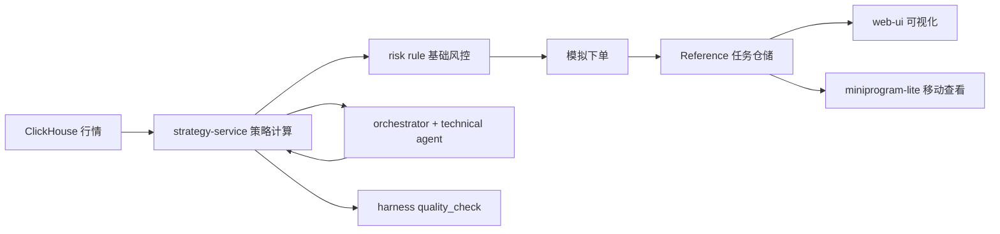

# AgenticHarness

AI 驱动量化系统的单人工程化实践项目。  
当前目标不是“一次做完全部架构”，而是先完成可运行、可验证、可演示的一期 MVP。

## 当前状态（2026-04-29）

项目处于“Reference MVP 已打通 + 正式持久化待补”阶段：

- 已有：
  - 基础设施编排：`docker-compose-mac.yml`、`docker-compose-win.yml`
  - Java Maven 多模块骨架：`services/`
  - Python Agent 骨架：`agents/`
  - Harness 骨架：`harness/`
  - 前端控制台：`web-ui/`
  - 小程序 Lite：`miniprogram-lite/`
  - Reference MVP：`services/strategy-service/src/main/java/com/quant/strategy/reference`
  - Harness 质检入口：`harness/validators/quality_check.py`
  - Agent 最小协同：`agents/technical/main.py`、`agents/orchestrator/main.py`
- 未完成：
  - Reference MVP 默认使用内存任务仓储；已提供 PostgreSQL store，可通过配置启用
  - Agent 当前是 Reference API 调用版，尚未接入真实 LLM 推理
  - Harness 当前调用 Reference API，尚未接入 CI
  - 小程序 Lite 当前是本地开发样板，正式发布前仍需 HTTPS 域名与鉴权

## 为什么要收敛范围

原一期规划包含：微服务拆分、双消息系统、多 Agent、分层多存储、可观测、K8s。  
对于单人项目，这会造成启动成本高、反馈周期长、任务切换频繁，难以持续推进。

因此当前采用策略：

1. 先打通最小闭环，再扩架构
2. 每周必须有可运行产物
3. 一期只做必要组件，其余明确延期到二期

## 一期 MVP（单人可执行版）

目标：在本地机器上打通一条完整链路。

1. 从 ClickHouse 读取历史 K 线
2. 运行双均线策略，输出买卖信号
3. 执行基础风控校验
4. 生成模拟订单（Reference 版先写入内存任务仓储，下一步替换 PostgreSQL）
5. 前端展示信号与订单结果
6. 质检脚本可检查指标并生成反馈

## 一期架构（收敛版）



说明：
- `strategy-service` 作为一期业务核心，不强求立即拆成全微服务
- Agent 一期只做最小协同（orchestrator + technical）
- Kafka/RocketMQ、Neo4j、Vector Sets、K8s 暂不作为一期硬门槛

## 8 周详细路线图

### Week 1-2：数据与回测闭环

- 完成最小基础设施启动：Redis、ClickHouse、PostgreSQL
- 固化数据导入脚本（可重复执行）
- 完成双均线回测脚本并输出核心指标：
  - 年化收益
  - 最大回撤
  - 夏普比率

验收标准：
- `python` 回测命令可稳定运行 3 次以上
- 输出指标格式统一，可被后续服务解析

### Week 3-4：策略服务化

- `strategy-service` 提供接口：
  - 触发回测
  - 查询回测结果
  - 生成策略信号
- 打通 ClickHouse 读取与 PostgreSQL 写入
- 加入基础风控规则（仓位、止损、单日亏损阈值）

验收标准：
- API 可通过 HTTP 调用，返回结构化 JSON
- 单策略单标的全流程成功率 > 90%

### Week 5-6：Agent 最小协同 + 前端联调

- `orchestrator` 能调用 `technical` 并汇总结果
- 策略信号经过风控后生成模拟订单
- 前端展示：
  - 最近信号
  - 回测指标
  - 模拟订单列表

验收标准：
- 页面可完整查看最近一次回测与下单结果
- Agent 失败时有可读错误日志

### Week 7：Harness 质检闭环

- 实现 `harness/validators/quality_check.py` 基础能力
- 指标阈值校验（例如 Sharpe < 1.0）
- 生成结构化反馈（JSON/Markdown）

验收标准：
- 一条命令触发质检并输出结果
- 失败项可追溯到具体策略/参数

### Week 8：稳态、文档、演示

- 补齐关键测试（策略计算、风控规则、关键接口）
- 固化一键启动与演示脚本
- 完成已知问题清单与下一阶段路线

验收标准：
- 新机器按文档 30 分钟内可拉起
- 完成一次端到端演示录屏或步骤文档

## 二期（明确延期，不阻塞一期）

详细路线见 `docs/ROADMAP_PHASE2_PLUS.md`。

阶段摘要：

- Phase 2：持久化与服务内模块化，先把内存任务仓储替换为 PostgreSQL。
- Phase 2.5：Mobile Lite，H5 移动适配已完成，小程序 Lite 原生样板已创建。
- Phase 3：正式策略与风控引擎，抽象 `StrategyEngine`、`RiskRule`，接入 JMA 与参数扫描。
- Phase 4：Agent 工程化，引入 LLM 结构化解释、Agent 审计和反馈闭环。
- Phase 5：事件驱动与服务拆分，逐步拆出 quote/backtest/risk/order/strategy。
- Phase 6：记忆、知识图谱与仿真，引入向量记忆、Neo4j 和压力情景。
- Phase 7：生产化与可观测，补 CI、监控、trace、部署和演示稳定性。

## 快速开始（当前骨架）

### 环境要求

- JDK 21
- Python 3.11+
- Node.js 18+
- Docker & Docker Compose

### 启动基础设施

```bash
docker compose -f docker-compose-mac.yml up -d
docker compose -f docker-compose-mac.yml ps
```

### 启动 Java（示例）

```bash
cd services/strategy-service
mvn spring-boot:run
```

Reference API：

```bash
curl -X POST http://localhost:8082/api/reference/backtest \
  -H "Content-Type: application/json" \
  -d '{
    "stockCode": "000001",
    "startDate": "2024-01-01",
    "endDate": "2024-12-31",
    "fastWindow": 5,
    "slowWindow": 20,
    "initialCash": 100000,
    "maxPositionRatio": 0.8,
    "stopLossRatio": 0.08
  }'
```

更多说明见 `docs/REFERENCE_MVP_SLICE.md`。

启用 Reference PostgreSQL 持久化：

```bash
psql "$REFERENCE_POSTGRES_URL" -f scripts/create_reference_postgres_tables.sql

REFERENCE_STORE_TYPE=jdbc \
REFERENCE_POSTGRES_URL=jdbc:postgresql://localhost:5432/harness_db \
REFERENCE_POSTGRES_USERNAME=harness \
REFERENCE_POSTGRES_PASSWORD=harness123 \
mvn -pl strategy-service spring-boot:run
```

### 启动 Agent（示例）

```bash
python agents/technical/main.py --base-url http://localhost:8082 --stock-code 000001
python agents/orchestrator/main.py --base-url http://localhost:8082 --stock-code 000001
```

### 运行 Harness 质检

```bash
python harness/validators/quality_check.py \
  --base-url http://localhost:8082 \
  --stock-code 000001 \
  --start-date 2024-01-01 \
  --end-date 2024-12-31
```

### 启动前端（示例）

```bash
cd web-ui
npm install
npm run dev
```

### 打开小程序 Lite（示例）

`miniprogram-lite/` 是 Phase 2.5 的微信原生小程序样板，用于手机端查看任务、触发快速回测和查看质检建议。

使用微信开发者工具导入：

```text
miniprogram-lite
```

本地开发默认访问：

```text
http://127.0.0.1:8082
```

如果真机调试无法访问本机地址，修改 `miniprogram-lite/utils/config.ts`，把 `API_BASE_URL` 改成电脑局域网 IP。更多说明见 `miniprogram-lite/README.md`。

### 演示脚本

```bash
scripts/demo/start-reference-mvp.sh
scripts/demo/run-reference-backtest.sh
scripts/demo/run-quality-check.sh
scripts/demo/stop-reference-mvp.sh
```

## 里程碑看板（建议）

- M0：基础设施可启动
- M1：数据导入 + 双均线回测（Reference Java 版已完成）
- M2：策略服务 API 可用（Reference API 已完成）
- M3：风控 + 模拟下单可用（内存版已完成，PostgreSQL store 已提供）
- M4：Agent 最小协同可用（Reference API 调用版已完成）
- M5：前端展示与质检闭环可用（Reference 控制台已完成）
- M6：Mobile Lite 可参考（H5 适配 + 小程序 Lite 样板已完成）

## 当前交接清单

如果你要看当前逻辑，建议按这个顺序读：

1. `docs/REFERENCE_MVP_SLICE.md`：先看整体链路和 API。
2. `services/strategy-service/src/main/java/com/quant/strategy/reference/`：看 Java Reference MVP 主逻辑。
3. `web-ui/src/views/Dashboard.vue`、`web-ui/src/views/Tasks.vue`、`web-ui/src/views/TaskDetail.vue`：看 Web 控制台如何调用接口。
4. `harness/validators/quality_check.py`：看质检闭环。
5. `agents/orchestrator/main.py`、`agents/technical/main.py`：看 Agent 当前如何基于 Reference API 工作。
6. `miniprogram-lite/README.md`：看小程序 Lite 本地开发方式。

当前仍建议你本机验收：

- 使用 `REFERENCE_STORE_TYPE=jdbc` 跑一轮真实 PostgreSQL 持久化。
- 使用本机 ClickHouse 数据连续触发 3 次回测。
- 用微信开发者工具打开 `miniprogram-lite/` 并确认能调用本机后端。

## 风险与应对

- 风险：范围膨胀导致长期无交付  
  应对：任何新需求必须标注“一期/二期”，默认放二期

- 风险：过度依赖外部组件，调试复杂  
  应对：优先同步调用打通链路，再逐步异步化

- 风险：文档与代码状态再次偏离  
  应对：每周更新本 README 的“当前状态”与“里程碑看板”

## 贡献原则（对自己也适用）

1. 小步提交，每步可运行
2. 先保证正确性，再优化性能
3. 所有关键脚本必须可重复执行
4. 每周至少一次端到端回归验证
