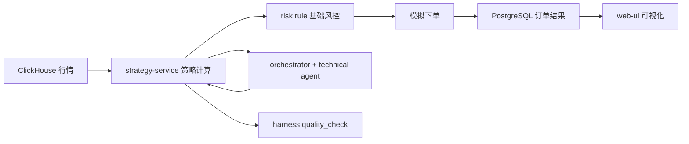

# AgenticHarness

AI 驱动量化系统的单人工程化实践项目。  
当前目标不是“一次做完全部架构”，而是先完成可运行、可验证、可演示的一期 MVP。

## 当前状态（2026-04-13）

项目处于“脚手架已搭建 + 核心链路未打通”阶段：

- 已有：
  - 基础设施编排：`docker-compose.yml`
  - Java Maven 多模块骨架：`services/`
  - Python Agent 骨架：`agents/`
  - Harness 骨架：`harness/`
  - 前端骨架：`web-ui/`
- 未完成：
  - 核心业务逻辑多数仍为 TODO/pass
  - 端到端交易闭环尚未打通
  - 自动化质检尚未形成稳定流程

## 为什么要收敛范围

原一期规划包含：微服务拆分、双消息系统、多 Agent、分层多存储、可观测、K8s。  
对于单人项目，这会造成启动成本高、反馈周期长、任务切换频繁，难以持续推进。

因此当前采用策略：

1. 先打通最小闭环，再扩架构
2. 每周必须有可运行产物
3. 一期只做必要组件，其余明确延期到二期

## 一期 MVP（单人可执行版）

目标：在本地机器上打通一条完整链路。

1. 从 ClickHouse 读取历史 K 线
2. 运行双均线策略，输出买卖信号
3. 执行基础风控校验
4. 生成模拟订单并写入 PostgreSQL
5. 前端展示信号与订单结果
6. 质检脚本可检查指标并生成反馈

## 一期架构（收敛版）



说明：
- `strategy-service` 作为一期业务核心，不强求立即拆成全微服务
- Agent 一期只做最小协同（orchestrator + technical）
- Kafka/RocketMQ、Neo4j、Vector Sets、K8s 暂不作为一期硬门槛

## 8 周详细路线图

### Week 1-2：数据与回测闭环

- 完成最小基础设施启动：Redis、ClickHouse、PostgreSQL
- 固化数据导入脚本（可重复执行）
- 完成双均线回测脚本并输出核心指标：
  - 年化收益
  - 最大回撤
  - 夏普比率

验收标准：
- `python` 回测命令可稳定运行 3 次以上
- 输出指标格式统一，可被后续服务解析

### Week 3-4：策略服务化

- `strategy-service` 提供接口：
  - 触发回测
  - 查询回测结果
  - 生成策略信号
- 打通 ClickHouse 读取与 PostgreSQL 写入
- 加入基础风控规则（仓位、止损、单日亏损阈值）

验收标准：
- API 可通过 HTTP 调用，返回结构化 JSON
- 单策略单标的全流程成功率 > 90%

### Week 5-6：Agent 最小协同 + 前端联调

- `orchestrator` 能调用 `technical` 并汇总结果
- 策略信号经过风控后生成模拟订单
- 前端展示：
  - 最近信号
  - 回测指标
  - 模拟订单列表

验收标准：
- 页面可完整查看最近一次回测与下单结果
- Agent 失败时有可读错误日志

### Week 7：Harness 质检闭环

- 实现 `harness/validators/quality_check.py` 基础能力
- 指标阈值校验（例如 Sharpe < 1.0）
- 生成结构化反馈（JSON/Markdown）

验收标准：
- 一条命令触发质检并输出结果
- 失败项可追溯到具体策略/参数

### Week 8：稳态、文档、演示

- 补齐关键测试（策略计算、风控规则、关键接口）
- 固化一键启动与演示脚本
- 完成已知问题清单与下一阶段路线

验收标准：
- 新机器按文档 30 分钟内可拉起
- 完成一次端到端演示录屏或步骤文档

## 二期（明确延期，不阻塞一期）

- 完整微服务拆分（quote/order/account/risk/backtest）
- Kafka + RocketMQ 生产级异步与幂等治理
- Redis Vector Sets 记忆系统
- Neo4j 情景推演引擎（simulation）
- K8s 部署与弹性扩缩容

## 快速开始（当前骨架）

### 环境要求

- JDK 21
- Python 3.11+
- Node.js 18+
- Docker & Docker Compose

### 启动基础设施

```bash
docker-compose up -d
docker-compose ps
```

### 启动 Java（示例）

```bash
cd services/strategy-service
mvn spring-boot:run
```

### 启动 Agent（示例）

```bash
cd agents/orchestrator
python main.py --config config.yaml
```

### 启动前端（示例）

```bash
cd web-ui
npm install
npm run dev
```

## 里程碑看板（建议）

- M0：基础设施可启动
- M1：数据导入 + 双均线回测
- M2：策略服务 API 可用
- M3：风控 + 模拟下单可用
- M4：Agent 最小协同可用
- M5：前端展示与质检闭环可用

## 风险与应对

- 风险：范围膨胀导致长期无交付  
  应对：任何新需求必须标注“一期/二期”，默认放二期

- 风险：过度依赖外部组件，调试复杂  
  应对：优先同步调用打通链路，再逐步异步化

- 风险：文档与代码状态再次偏离  
  应对：每周更新本 README 的“当前状态”与“里程碑看板”

## 贡献原则（对自己也适用）

1. 小步提交，每步可运行
2. 先保证正确性，再优化性能
3. 所有关键脚本必须可重复执行
4. 每周至少一次端到端回归验证

